# **🎓📊 ATTENDEASE – Your Smart Attendance Buddy!**
**Track smart. Stay focused. Beat the shortage.**  
_Made with ❤️ by Shoovam aka Ironheart_

  
  
  

---

## **✨ Welcome to Attendease!**
**Attendease** is more than just an attendance tracker – it’s your daily companion for smart class management 😎.  
Built with **Kotlin** and **Jetpack Compose**, infused with **Material You design**, and loaded with expressive **Lottie animations** – this app is as stunning as it is powerful.  

A one-man indie dev passion project – crafted to help students stay in control, effortlessly 💯.

---

## **📸 Promo Banner**
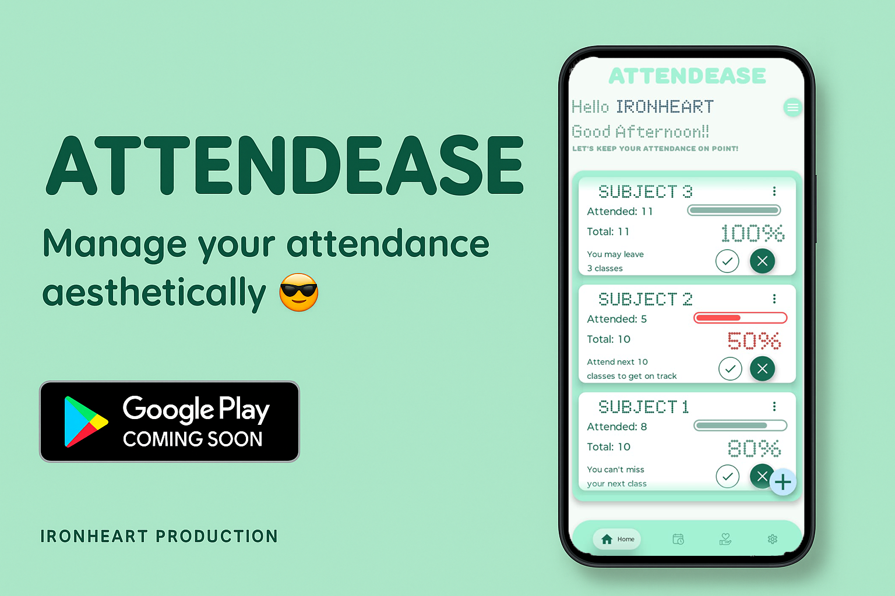

---

## **🧰 Tech Stack & Tools Used**
| **Tool** | **Purpose** |
|------|---------|
| 🚀 **Kotlin** | Primary language |
| 🖌️ **Jetpack Compose** | Modern declarative UI |
| 🎨 **Material You** | Dynamic theming |
| 🏛️ **MVVM + Clean Architecture** | Scalable and maintainable code |
| 🗃️ **Room Database** | Local data persistence |
| ⏰ **AlarmManager + BroadcastReceiver** | Offline reminder scheduling |
| 💸 **Razorpay SDK** | Donation system (testing mode) |
| 🛠️ **Android Studio 2024.2.1 Patch 3**| Dev environment |
| 🎞️ **Lottie Composable** | Smooth animations |

---

## **📱 Features You’ll Love**
### ✅ Attendance Management Made Easy
- 📚 Add subjects & **create** your own custom timetable

- ✔️ Mark presence with a tick 

- ❌ Mark absence with a cross 

- 🔄 **Auto-calculated** attendance percentage in real-time

---

### **⏰ Offline Smart Reminders**
- 🕒 Get **class notifications** right on time

- 📴 Works **offline** using system-level alarms

- 🗓️ **Daily scheduler** keeps your routine tight & on track

---

### 📊 Smart Attendance Insights
- 📌 View subject-wise **attendance percentages**

- 🎯 Set your **minimum attendance target**

- 🤓 Get smart **suggestions**:

   - How many classes you can bunk (safely 😉)

   - How many you need to attend to hit your goal
 
---

### **🌈 Sleek, Adaptive UI/UX**
- 🎨 Follows **Material You** – changes with your phone’s wallpaper (**Dynamic Themeing only Available on Android 12+ devices**)

- 🌞 **Light Theme** / 🌚 **Dark Theme**

- 🧭 Clean navigation with a **Bottom Navigation Bar**

- 🕺 Smooth, expressive **Lottie animations** for every state!

---

### **💸 “Support a Developer”**
- ❤️ Love indie projects? Support development inside the app

- 🔐 **Razorpay** flow integrated (**Not Live!! currently for dev testing**)

- 🙌 Every donation helps small creators build big dreams

---

### **🔮 Upcoming Features**
- 🚧 Work in Progress – Stay tuned for more magic:

  - 🧱 Home screen **widgets** for instant subject marking

  - 📆 Google Calendar sync

  - ☁️ Cloud **backup** & **restore**

  - 📈 Advanced stats and insights dashboard

---

## **🧪 How to Run Locally**

_**👉 Click the badge above to download the latest APK (ANDROID 9+)**_

Or, build it yourself:

    git clone https://github.com/shoovamjena/AttendEase
    cd attendease

---

## **Installation**

1. **Open the project in Android Studio 2024.2.1+**
2. **Connect a physical device or emulator (API 28+)**
3. **Hit ▶️ to build and run**

⚠️ **Make sure:**
- ✅ Gradle is synced
- ✅ Required permissions (Notifications, Alarms) are granted

---

## **📸 Screenshots**

### **🏠 Home Screen**

| Light Theme | Dark Theme |
|-------------|------------|
| 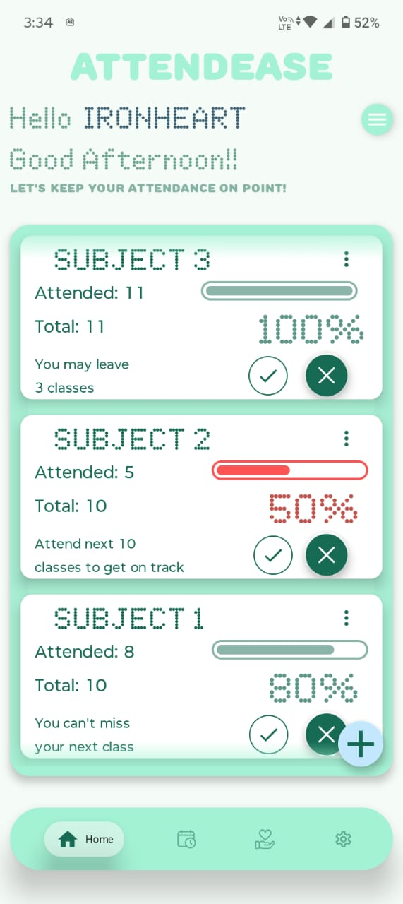 | 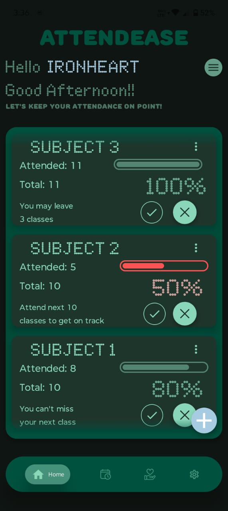 |

---

### **📅 Timetable View**

| Light Theme | Dark Theme |
|-------------|------------|
| 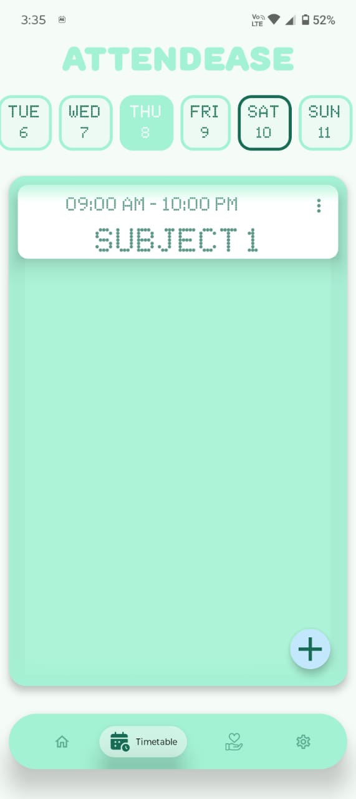 | 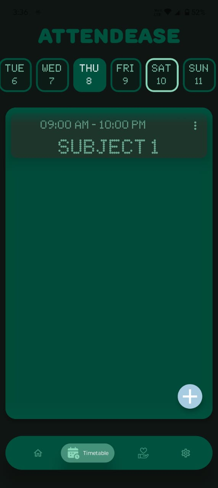 |

---

### **💸 Support Screen**

| Light Theme | Dark Theme |
|-------------|------------|
| 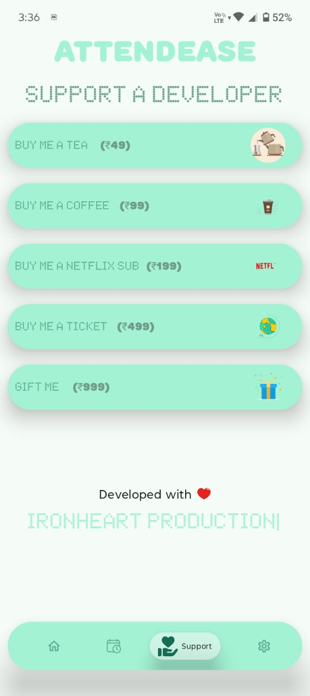 | 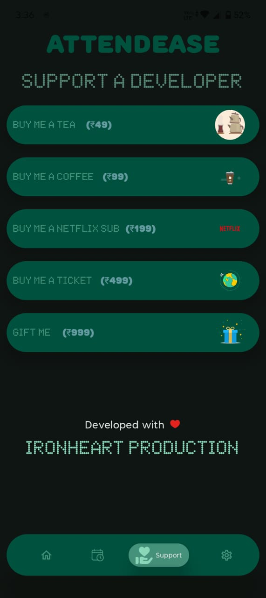 |

---

### **⚙️ Settings Screen**

| Light Theme | Dark Theme |
|-------------|------------|
| 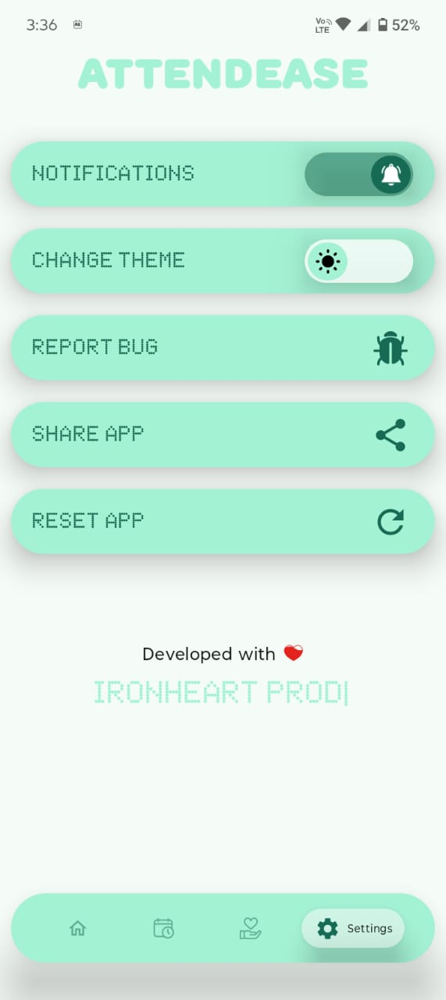 | 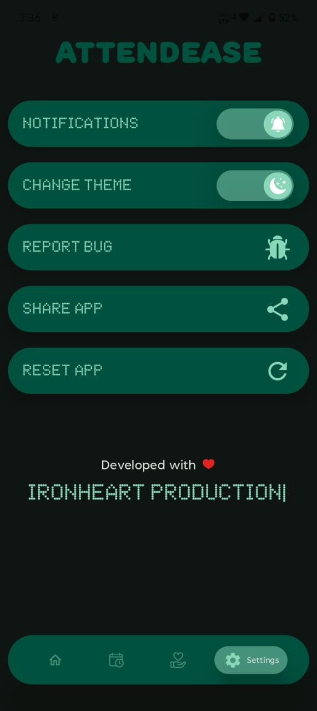 |

---

### **📊 Attendance Detail Screen**

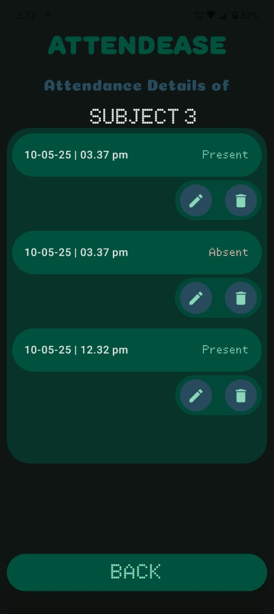

---

### **🎨 Material Theme Light**

| Cyan | Pink | Orange | Green |
|------|------|--------|-------|
| 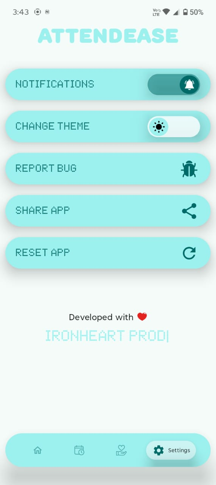 | 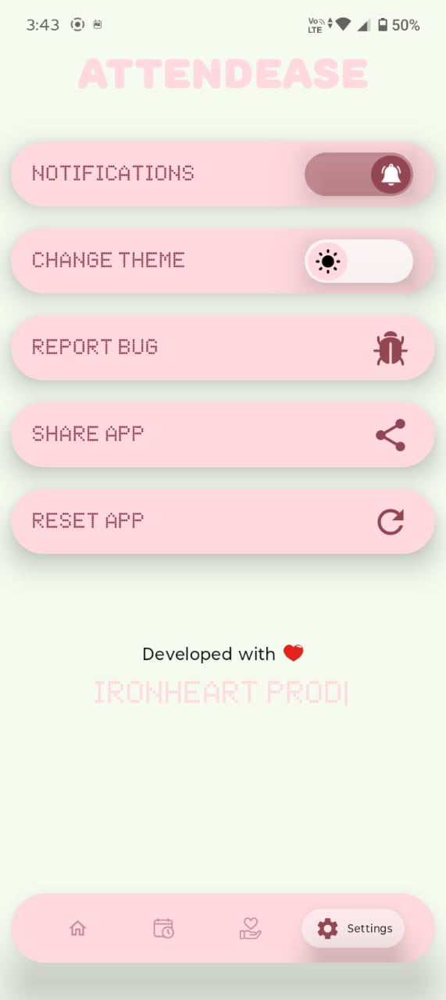 | | 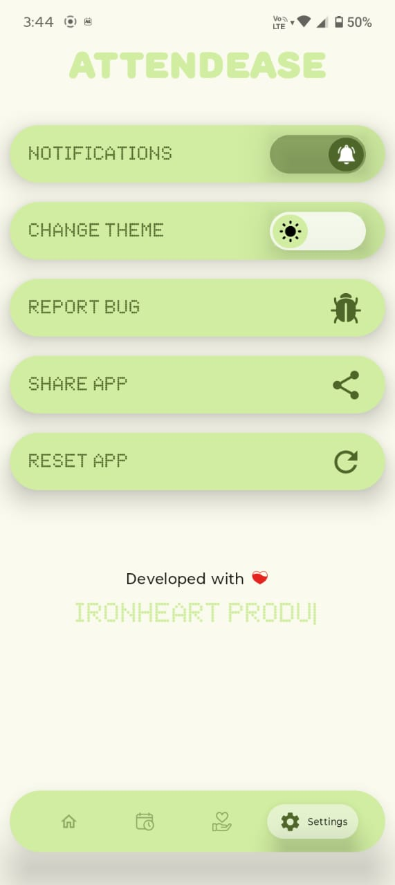 |

---

### **🌙 Material Theme Dark**

| Cyan | Pink | Orange | Green |
|------|------|--------|-------|
| 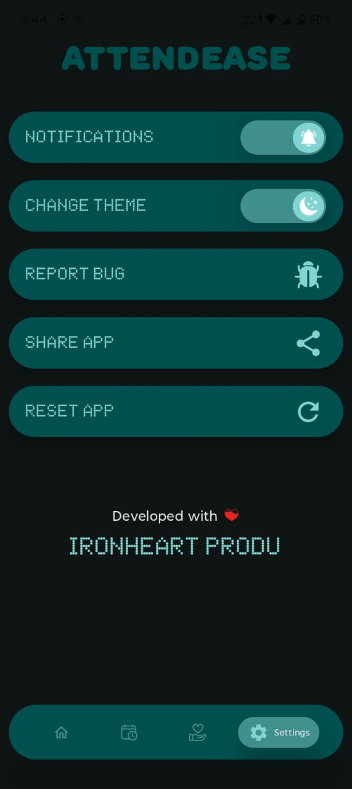 | 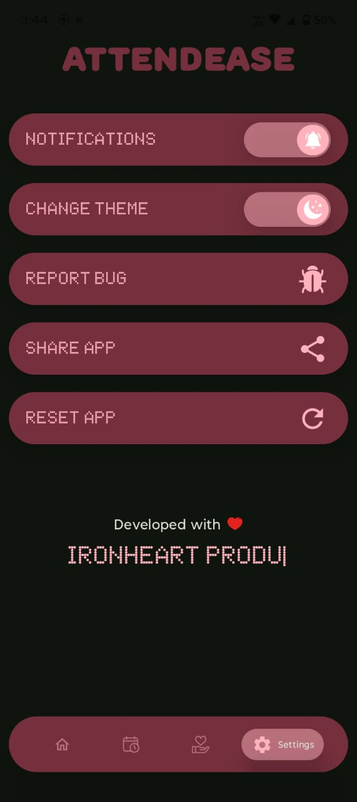 |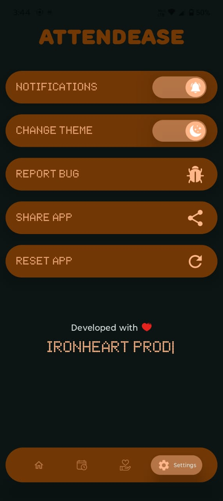 | 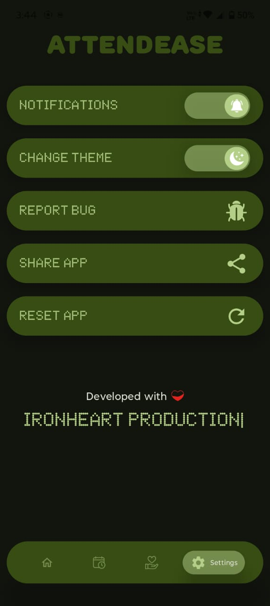 |

---

## **🎥 App Demo**

| App Walkthrough | Notification Demo |
|-----------------|-------------------|
| https://github.com/user-attachments/assets/dbeecf48-d01d-4513-91d5-0b028b9ca753 | https://github.com/user-attachments/assets/c0a25e94-2c58-4c11-b950-3099f0d2e1b5 |

---

## **🤝 Support & Feedback**
### If you love this project, help it grow:
---
- ⭐ **Star** this repo
- 📤 **Share** it with friends
- 💸 Donate when it’s **live**
- 💬 Share feedback at - [**ironheartx09@gmail.com**](mailto:ironheartx09@gmail.com) or **contribute!**
---
## **👨‍💻 About the Developer**
- 👋 Hey! I’m **Shoovam**
- 🎭 Instagram: [**@ironheart_x_**](https://www.instagram.com/ironheart_x_/)
- 🎥 Video Edits: _Ironheart Production_
- 📸 Photos: Captured by _Ironheart x_
- 🧠 Builder of apps. Teller of stories. Believer in effort over hype.

## **🚀 Final Note**
Attendease isn’t just an app. It’s a **tool made from struggle, vision, and love** – for students like you. So go ahead, ace your classes, skip smartly 😉, and stay in control like never before.

**Built with ❤️, bugs, caffeine & a dream.**

